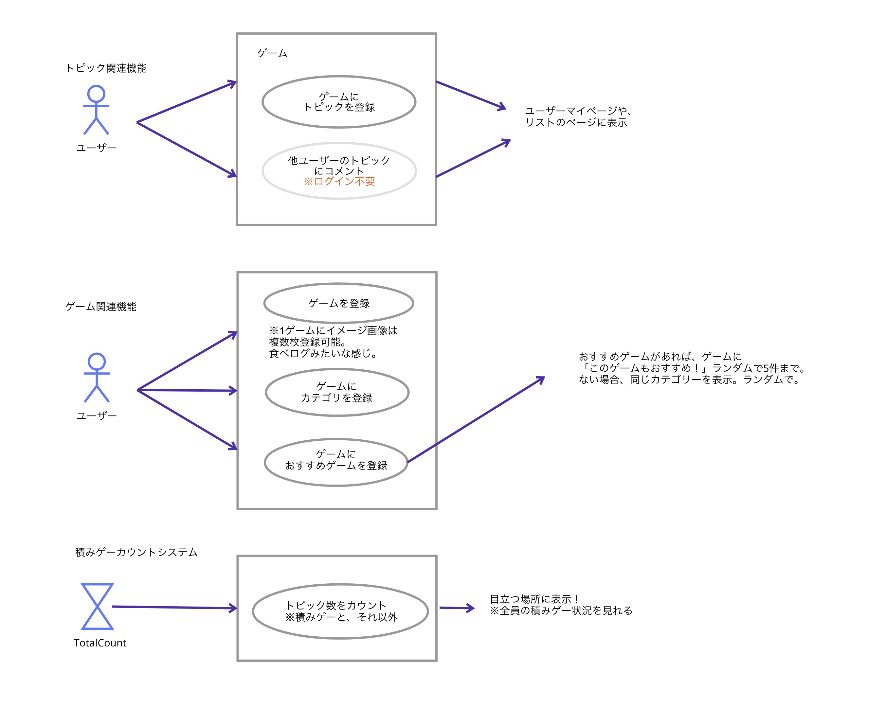

## ゲームのログを残し、よりエンジョイするサービス

◼️サービス特徴 
・ゲームのプレイ感想メモをのこせる。 
・関連ゲームを探せる（他の人のおすすめゲーム、同じカテゴリのゲーム） 
・トピックごとに自分だけの履歴を残すことができる 
・トピックごとにタイトル、画像、本文、プレイ状態、カテゴリを設定できる。 

◼️技術的特徴 
・サービス登録にはメアドを利用。（ツイッターを使いたかったが最近api厳しくなりそうなので中止）
・バックエンドはlaravelのAPI（別リポジトリ） 
・ディレクトリ構造はatomicdesignやらdddもどきやら色々変えたり試しています 
・CSSは全体でSASSでまとめてる(css in jsも検討) 
・React 
・Typescript 

## ユースケース図

(仮)アーキテクチャ 
  
ドメイン層  
typeの指定。

  
他：インターフェイス  
インフラ層で使うクラスをここで作成する？  

//メモ
// GameRepogitory.SearchGame(keyword).then((data)=>{
//     setResult([data])
//     console.log('result')
//     console.log(data)
// })

  
インフラ層：infra(仮)  
現状は使っていない。
テストしやすいよう、ユースケースで使うドライバーのクラスをここで作る？

  
ユースケース層：usecase  
fooks、関数の記載 

  
プレゼンテーション層：component 
ビュー。最終ロジックもここに記載。 

   

参考：https://www.gixo.jp/blog/16133/ 

